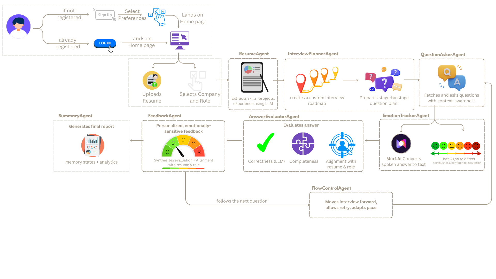
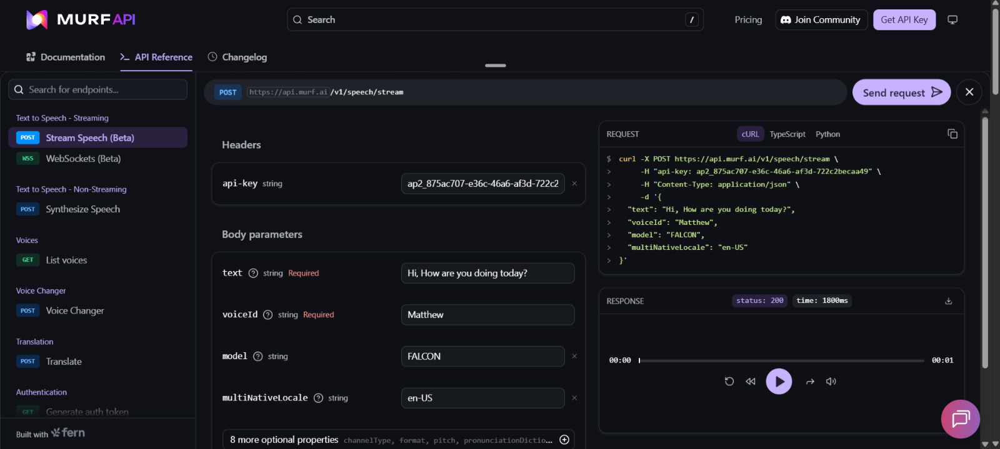

# 🚀 Placementor — AI-Powered Voice Interview Coach  
### **Built Using Murf Falcon**

<p align="center">
  
</p>

## Deployed Link: [link](https://place-mentor-murf-ai.vercel.app/)

## 📚 Table of Contents  

- [Features](#features)
- [Tech Stack](#tech-stack)
- [Agents](#agents)
  - [Feedback Agent](#feedback-agent)
  - [Question Fetcher](#question-fetcher)
  - [Interview Planner](#interview-planner)
  - [Resume Parser](#resume-parser)
- [Installation](#installation)
- [Usage](#usage)
- [Screenshots](#screenshots)
- [Developed By](#developed-by)
---
## About

**Placementor** is a next-generation **voice-first interview training platform** designed to help users practice, improve, and perfect their interview performance.  Placementor is **powered by** by integrating:

✅ **Murf Falcon TTS** for ultra-natural, real-time question narration  
✅ **Automatic Speech Recognition (ASR)** for live conversational interaction  
✅ **AI Agents** for adaptive question generation & feedback  

This transforms Placementor from a text-based prep tool into a **fully conversational AI interview mentor.**

---

## Why Voice-First?

IRL Interview depend on your communication skills. There are very few platforms where you can actually practice your communication skills with questions specific to your target company.

Using Murf Falcon + ASR, Placementor now simulates a **real interview room**:  
- You *hear* the interviewer (Murf Falcon)  
- You *speak* the answer (ASR)  
- You *receive* instant, structured feedback (AI Agents)  

This enables:
- More immersive prep  
- Better vocal confidence  
- Practice under real interview pressure  
- Training for tone, clarity, and speaking patterns  

---

## How Murf Falcon Enhances Experience

Murf Falcon was a **crucial upgrade** to elevate the realism of the interview simulation:

- **Low-latency TTS** enables fluid back-and-forth exchanges  
- **Stable API output** allowed seamless integration with Flask backend  
- **Reduced cognitive load** for users—users focus on answers instead of reading text  

This made the project’s shift to **voice-first AI** not just possible, but truly powerful.

---

## 🔁 System Flow  
<p align="center">
  
</p>

---
## Features

- 🎤 **Voice-first Interview Simulation** using Murf Falcon TTS  
- 🗣️ **Real-time ASR-based Response Capture**  
- 📄 **Resume Upload & Parsing**  
- 🧠 **AI Interview Planner** generates role/company-specific questions  
- ❓ **Dynamic Question Fetching**  
- 📊 **AI Feedback Agent** provides structure, clarity & relevance scores  
- 🔁 **Repeat Question Logic** for mastery learning  
- ⚡ **Fast Flask Backend for Real-Time Conversations**

---

## Tech Stack

- **Frontend:** React.js, Tailwind CSS  
- **Backend:** Python, Flask  
- **Voice Tech:**  
  - **Murf Falcon TTS API**  
  - **ASR** (Automatic Speech Recognition)  
- **AI Agents Framework:** Agno + Gemini  
- **Others:** Axios, JSON, Git  

---

# Agents

## Resume Parser

- Extracts structured resume data: name, email, phone, skills, projects, education, experience.  
- Uses Gemini via Agno Framework.  
- Returns clean JSON with parsed content.

---

## Interview Planner

- Generates **progressively difficult** interview questions.  
- Personalized based on company, role, resume, and round.  
- Outputs a detailed JSON plan.

---

## Question Fetcher

- Retrieves specific questions by serial number.  
- Ensures smooth integration with the voice agent step.

---

## Feedback Agent

- Evaluates user answers using AI scoring parameters: structure, clarity, relevance, depth.  
- Provides:  
  - Score (1–10)  
  - Detailed feedback  
  - Corrected ideal answer  
  - Repeat-or-proceed recommendation  


## Installation

1. Clone the repository:
   ```bash
   git clone https://github.com/tejasgadge2504/place-mentor_MurfAI
   ```

2. Navigate to the project directory:
   ```bash
   cd Placementor
   ```

3. Install the required dependencies:
   ```bash
   pip install -r requirements.txt
   ```

## Usage

1. **Upload Resume (PDF)**
2. **Select Target Company + Role + Round**
3. **Start Voice Interview**
   - Murf Falcon narrates questions  
   - ASR captures user answers  
4. **Get Instant Feedback**
5. **Repeat or Proceed Based on AI Recommendations**

---

## Screenshots

<table>
  <tr>
    <td align="center">
      
    </td>
    <td align="center">
      
    </td>
  </tr>
  <tr>
    <td align="center">
      
    </td>
    <td align="center">
      
    </td>
  </tr>
  <tr>
    <td align="center">
      
    </td>
    <td align="center">
      
    </td>
  </tr>
</table>

---

## Why This Project Stands Out (Winning Angle)

### **1. Fully Voice-First Experience**
A seamless loop of **listen → speak → analyze → respond**, powered by **Murf Falcon + ASR**.

### **2. Hyper-Realistic Interview Simulation**
Tone-balanced **Falcon voices** create real HR/technical interview dynamics.

### **3. Modular Dual-Agent Architecture**
- **Murf Falcon** handles narration  
- **AI Agents** handle question planning & feedback  
A future-ready foundation for multi-agent interoperability.

### **4. High-Impact Real-World Use Case**
Solves a major pain point for millions of **students and job-seekers**.

### **5. Scalable & Extensible**
Future enhancements include:
- Multiple voice personalities  
- Mock HR stress testing  
- Multilingual interview modes  
- Company-specific interview packs  
- Behavioral + technical + system design rounds  

---

## Developed By

- [Tejas Gadge](https://github.com/tejasgadge2504)
- [Anisha Shankar](https://github.com/hahaanisha)
